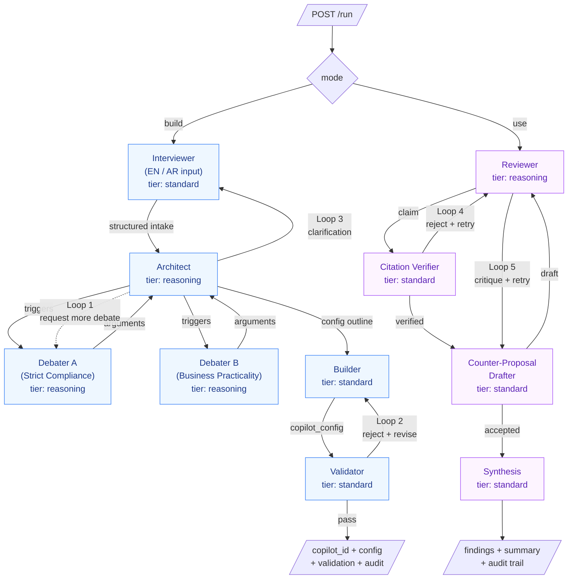
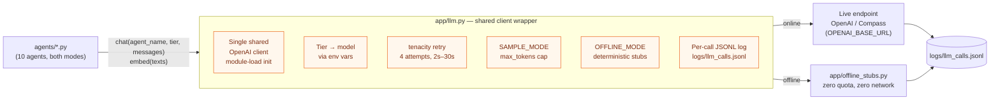

# Wakeel Architecture

## 1. Problem Statement

### Use case

**G42 Agentathon Problem Statement #21 — Legal Intelligence.** Wakeel targets
the in-house legal and compliance workflow in UAE regulated enterprises, with
a specific focus on the document-review function that consumes the majority of
in-house counsel time.

### The visible problem

Compliance officers and in-house counsel across UAE enterprises review high
volumes of NDAs, vendor agreements, employment contracts, and partnership
documents against the UAE's growing regulatory framework — UAE Federal
Decree-Law 33 of 2021 (Labour Law), Federal Decree-Law 45 of 2021 (Personal
Data Protection Law), Federal Law 5 of 1985 (Civil Transactions Law), Federal
Law 18 of 1993 (Commercial Transactions Law), and many others including Trade
Secrets, Cybercrimes, and Commercial Companies legislation.

A typical UAE fintech compliance officer reviews 15–30 vendor NDAs per week. A
UAE hospital compliance director handles 40–60 supplier and partnership
contracts per month. Each document takes 45–90 minutes of manual
clause-by-clause comparison.

The work is **slow**, **inconsistent across reviewers**, **difficult to
scale**, **error-prone**, and **hard to audit** — exactly the kind of
structured, citation-heavy, repetitive cognitive labour where AI should help.

### The deeper problem (the gap generic legal AI doesn't address)

Generic legal AI products (Harvey, Casetext, vLex) review documents against
generic legal knowledge. They do not capture how **your specific organization**
interprets each clause:

- That **your** organization treats a 30-day notice period as standard but
  rejects 60-day notices.
- That **your** hospital requires explicit consent language beyond PDPL's
  statutory baseline.
- That **your** fintech's risk threshold for vendor data access is stricter
  than industry norms.

These interpretation choices are made by senior counsel over years. They live
in email threads, Slack discussions, half-written policy memos, and the
institutional memory of long-tenured staff. Generic AI cannot capture this —
yet without this interpretation layer, AI legal review is at best 40% useful.

### Target users

| Persona | Role | Volume | Primary need |
|---|---|---|---|
| Sarah | In-house counsel, UAE fintech | 20–30 NDAs/week | Verified citations + fast redline against org stance |
| Ahmed | Compliance director, UAE hospital | 40–60 contracts/month | Higher throughput; reserve senior attention for high-risk 10% |
| Mohammed | Partner, boutique UAE law firm | Multiple client engagements | Junior-associate leverage; firm-wide consistency |

### Why this matters (hard ROI)

For a typical mid-market UAE enterprise with 50 contracts/month requiring 1
hour senior counsel review at AED 1,000/hour fully-loaded cost:

- **Without Wakeel:** 50 × 1 hour × AED 1,000 = **AED 50,000/month**
- **With Wakeel:** 50 contracts × 6 minutes senior review + platform cost
  = **~AED 6,250/month**
- **Annual savings:** ~AED 525,000 (~$143,000 USD)
- **Payback period:** ~2 months

### What Wakeel adds that generic legal AI doesn't

Wakeel encodes **organizational interpretation as a deployable artifact**.
Each Wakeel copilot is built from a structured interview with the customer's
senior counsel, debated through dual-stance agents (strict vs. practical),
synthesized into a config, and instantiated as a deployable copilot. The
institutional interpretation layer becomes runtime behaviour — not a
600-line redline playbook that lives in someone's OneNote.

This is the architectural moat: not the model, not the corpus, not the
prompts. The **org-adaptation layer** is what makes Wakeel YOUR copilot rather
than a generic legal AI fine-tuned for everyone equally.

## 2. Solution Overview

### What Wakeel does in one paragraph

Wakeel is a sovereign UAE regulatory AI platform with two integrated modes.
**Build Mode** mints a custom legal copilot for an organization through a
multi-agent interview-debate-synthesis pipeline that encodes the
organization's interpretation of UAE law. **Use Mode** runs that copilot
against real documents — flagging risks, verifying every citation against the
actual statute text, drafting counter-proposals, and producing a complete
audit trail. The system runs entirely on Compass (G42's sovereign UAE AI
infrastructure) and uses Inception's Arabic-tuned model for native Arabic
intake.

### The bimodal design

Most legal AI is monolithic — one interface, one workflow. Wakeel is
deliberately bimodal because the moat (org-tuned interpretation) and the
daily value (document review) require different agent topologies:

- **Build Mode** (6 agents, Loops 1–3) mints copilots that encode
  interpretation.
- **Use Mode** (4 agents, Loops 4–5) runs those copilots on documents.

The same orchestration framework, audit trail, LLM wrapper, and corpus serve
both. Only the agent council and acceptance criteria differ per mode.

### Input → output summary

| Mode | Input | Output |
|---|---|---|
| Build | Free-text workflow description (Arabic or English) + org context | `copilot_id` referencing a configured Wakeel copilot + validation report + audit trail |
| Use | Reference to an existing `copilot_id` + a document to review | Findings list with verified citations, severity tags, counter-proposals, recommendation banner, and audit trail |

### The killer feature: Loop 4 (Citation Verification)

Generic legal AI hallucinates citations regularly — confidently citing "PDPL
Article 99" when no such article exists. This is the single biggest reason
in-house counsel don't trust AI for legal work.

Wakeel's Citation Verifier is **not an LLM call** — it is orchestrator-driven
exact-text retrieval against ChromaDB. Every citation the Reviewer agent emits
is looked up in the corpus by article ID. On a miss, the verifier returns the
top-3 semantic candidates and forces the Reviewer to re-cite. A hallucinated
citation cannot survive the audit trail.

In live testing against Compass on three NDA examples, Loop 4 caught **4
hallucinated citations across one document** (data-broker NDA) — each one
rejected by the Verifier and corrected by the Reviewer through forced
re-cite.

### Sovereign UAE positioning (three layers)

| Layer | Implementation |
|---|---|
| Infrastructure | Compass (Core42 / G42), UAE-hosted, UAE-operated |
| Model | `G42-INCEPTION-GPT41-MSA` (Inception Arabic MSA) on the Interviewer for sovereign Arabic intake; `gpt-4.1` and `gpt-5.1` on Compass for downstream reasoning |
| Corpus | UAE Federal statutes sourced exclusively from the official UAE Legislation Portal (`uaelegislation.gov.ae`) |

This layering is what enables Wakeel to credibly position as UAE-native AI
for UAE-native law, rather than retrofitted Western AI translated to UAE
jurisdiction.

## 3. Agent topology

Wakeel is a 10-agent system across two modes. **Both modes are implemented:**
Milestone 1 delivered the six build-mode agents (Loops 1–3); Milestone 2 added
the four use-mode agents (Reviewer, Citation Verifier, Counter-Proposal Drafter,
Synthesis) and Loops 4–5.

### Agent topology (rendered diagram)



### Agent topology (ASCII fallback)

```
                          POST /run  { mode: "build" }
                                     │
                                     ▼
                          ┌────────────────────┐
                          │     Interviewer     │  tier: standard
                          │  (English / Arabic) │  replies in user's language
                          └─────────┬──────────┘
                                    │ structured intake (English)
            Loop 3 (clarification)  │  ◄──────────────────────────┐
                                    ▼                              │
                          ┌────────────────────┐                  │
                 ┌──────► │   Stance Debate     │  tier: reasoning │
                 │        │  Debater A (strict) │                  │
   Loop 1        │        │  Debater B (practical)                 │
 (debate rounds) │        └─────────┬──────────┘                  │
                 │                  │ debate transcript            │
                 │                  ▼                              │
                 │        ┌────────────────────┐                  │
                 └────────│      Architect      │ ─────────────────┘
                          │ (synthesize / escalate / request debate)
                          └─────────┬──────────┘  tier: reasoning
                                    │ config_outline
                                    ▼
                          ┌────────────────────┐
                 ┌──────► │      Builder        │  tier: standard
                 │        │ (prompts, schema,   │
   Loop 2        │        │  retrieval, thresholds)
 (validation)    │        └─────────┬──────────┘
                 │                  │ copilot_config
                 │                  ▼
                 │        ┌────────────────────┐
                 └────────│      Validator      │  tier: standard
                          │ (runs sample input) │
                          └─────────┬──────────┘
                                    │ pass
                                    ▼
                   copilot_id + config + validation + audit_trail
```

### Agent / tier mapping (PRD §7)

| Agent | Mode | Tier | Notes |
|---|---|---|---|
| Interviewer | build | standard | EN/AR input; structured English output. |
| Debater A — Strict | build | reasoning | Conservative interpretation. |
| Debater B — Practicality | build | reasoning | Workable positions. |
| Architect | build | reasoning | Synthesis + Loop 1/3 control. |
| Builder | build | standard | Instantiates the copilot config; config persists to `data/copilots/`. |
| Validator | build | standard | Rejects substandard configs (Loop 2). |
| Reviewer | use | reasoning | Emits findings with citation. Re-cites on Loop 4. Critiques drafts on Loop 5. |
| Citation Verifier | use | standard | Orchestrator-driven exact-text lookup against the corpus (Loop 4). |
| Counter-Proposal Drafter | use | standard | Drafts replacement clauses for flagged findings; revises on Loop 5 critique. |
| Synthesis | use | standard | Assembles final findings, summary, and recommendation. |

## 4. Feedback loops

| Loop | Trigger | Convergence cap |
|---|---|---|
| 1 — Stance debate | Architect requests ≥2 rounds before synthesis | 3 rounds |
| 2 — Validation reject | Validator fails the sample run → Builder revises | 3 iterations |
| 3 — Requirements clarification | Architect detects ambiguity → Interviewer follow-up | 2 escalations |
| 4 — Citation rejection | Reviewer's citation not found in corpus → re-cite from semantic-search candidates | 3 per finding |
| 5 — Counter-proposal critique | Reviewer-as-critic rejects a Drafter clause → Drafter revises | 3 per finding |

Routing lives in `app/graph/build_graph.py` (build) and `app/graph/use_graph.py`
(use). Routers are **read-only**; all state mutation (loop counters, flags)
happens inside nodes so counters survive routing. Hard caps guarantee termination.

### Loop 4 — Citation rejection (the killer feature, PRD §16)

The Citation Verifier is **not an LLM call** — it is orchestrator-driven
exact-text retrieval against ChromaDB. Every Reviewer finding emits a citation
`{law, article}`; the verifier looks up the exact article by ID (e.g.
`PDPL:art-7`). On a miss, the verifier asks the corpus for the top-3 semantic
candidates and feeds them back to the Reviewer for re-cite. The result: a
hallucinated citation cannot survive the audit trail — the audit shows the
rejection moment with the actual exact text of the eventually-cited article.

Canonical evidence: `logs/samples/use_mode_run_loops_4_5.jsonl`.

### What counts as a "Loop X firing"

A loop fires every time its defining agent runs — verifier for Loop 4, critic
for Loop 5 — **regardless of whether the outcome was accept or reject**. This
is the definition the audit trail itself records (every relevant entry is
tagged `loop="Loop 4"` or `loop="Loop 5"`), and it is what the M2.2 acceptance
gate counts. Rejection counts (`summary.citation_rejections`,
`summary.draft_critiques`) remain in the response as a separate **quality**
signal — they tell you how often the model needed a second pass — but they
are not what the gate measures, because a perfect first-try Reviewer/Drafter
should not be punished for getting it right.

## 5. LLM client architecture (SOW §6)



```
       agents/*.py
          │  chat(agent_name, tier, messages)   embed(texts)
          ▼
   ┌──────────────────────────────────────────────┐
   │                 app/llm.py                     │
   │  • single shared OpenAI client (module load)   │
   │  • tier → model resolution (env vars)          │
   │  • tenacity retry (4 attempts, 2s–30s)         │
   │  • SAMPLE_MODE max_tokens cap                   │
   │  • OFFLINE_MODE deterministic stubs            │
   │  • per-call JSONL logging (logs/llm_calls.jsonl)│
   └──────────────────────────────────────────────┘
          │                         │
          ▼                         ▼
   Live endpoint (env)        app/offline_stubs.py
   OpenAI direct or Compass   (no network, zero quota)
```

**Endpoints (same code, swap via `.env`):**

| Profile | `OPENAI_BASE_URL` |
|---|---|
| Developer | `https://api.openai.com/v1` |
| Compass (M1/M2 acceptance) | `https://api.core42.ai/v1` |

**Model tiers** (confirmed on Compass; defaults in `.env.example`):

| Tier | Env var | Model |
|---|---|---|
| Standard | `DEFAULT_MODEL` | `gpt-4.1` |
| Reasoning | `REASONING_MODEL` | `gpt-5.1` |
| Embedding | `EMBEDDING_MODEL` | `text-embedding-3-large` |

Optional: `INTERVIEWER_MODEL=G42-INCEPTION-GPT41-MSA` for the sovereign-AI demo
(Inception Arabic on Compass) — per-agent override only.

**Invariants:** agents never import `OpenAI` or instantiate a client; they request
a *tier*, never a model name; `agent_name` is required for audit attribution.
Swapping endpoints or models is an env-var change only.

Every call logs: `timestamp, agent, model, tier, latency_seconds, input_tokens,
output_tokens, status, error_message`.

## 6. Corpus pipeline

- `data/corpus/corpus_config.json` declares each statute: `law_name`, `file`, and
  an `article_pattern` regex. Adding a statute is a config + data drop.
- `app/corpus/ingest.py` splits each statute by article, embeds via the wrapper,
  and stores in ChromaDB with metadata (`law_name`, `short_name`, `article_number`).
- `app/corpus/retrieval.py` exposes `semantic_search()` (Reviewer) and
  `get_article()` (exact-text lookup for the Citation Verifier).

**Current corpus (PRD §5):**

| Law | Short name | Articles ingested |
|---|---|---|
| Federal Decree-Law 33 of 2021 | Labour Law | 8 |
| Federal Decree-Law 45 of 2021 | PDPL | 8 |
| Federal Law 18 of 1993 | Commercial Transactions Law | 6 |
| Federal Law 5 of 1985 | Civil Transactions Law | 7 |

All four ship with public placeholder excerpts; replace with official PDFs as a
data drop without code changes.

## 7. Copilot registry

`app/copilot_registry.py` is a file-backed JSON store under `data/copilots/`.
Build mode persists `copilot_config` keyed by `copilot_id`; use mode loads it
back so the produced copilot is replayable across sessions. `GET /copilots`
lists what has been built.

## 8. Audit trail

`app/logging_utils.py` defines `AuditTrail`, collecting one entry per agent action
(`agent, action, decision, reason, loop, details`). Entries are streamed to
`logs/run_<run_id>.jsonl` and returned in the API response, then rendered in the
Streamlit sidebar.

### Decision history per copilot (read-side)

`app/decision_history.py` exposes a pure read function over the same JSONL
files: `history_for_copilot(copilot_id)` scans `logs/run_*.jsonl`, groups
entries by run, filters to runs that reference the given `copilot_id`, and
returns a list of per-run summaries (mode, started/ended timestamps, entry
count, loops fired, full entries). It is the read counterpart to
`AuditTrail.add` — same files, no extra storage. Surfaced via the
`GET /decisions/{copilot_id}` endpoint described in §9. The
`copilot_id` is recovered structurally: build-mode logs carry it in the
Builder action's `details.copilot_id`; use-mode logs carry it in the
orchestrator's `run_start` `details.copilot_id` (with a defensive
fallback parse of the `reason` field for older logs predating that tag).

## 9. Services & ports

| Service | Entry | Port |
|---|---|---|
| API (FastAPI) | `run.py` → `app.api:app` | 8000 |
| UI (Streamlit) | `run_ui.py` | 8001 |

Both run together via `docker-entrypoint.sh` in the Docker image. Verified clean
build + run from a fresh clone with both ports responding under 2s; full
use-mode arc through the container reproduces the canonical Loop 4/5 evidence —
see [`docs/use-mode-evidence.md`](use-mode-evidence.md).

### HTTP endpoints

| Method | Path | Purpose |
|---|---|---|
| GET  | `/health` | Liveness + current LLM client config (key masked). |
| GET  | `/config` | Current LLM provider configuration. |
| POST | `/config` | Runtime provider/model swap (front-end provider switch). |
| GET  | `/copilots` | List copilots currently registered in `data/copilots/`. |
| POST | `/run` | Build mode (`mode="build"`) or use mode (`mode="use"`). |
| GET  | `/decisions/{copilot_id}` | Full decision history for a copilot — every run, every audit-trail entry. Read-only wrapper over `logs/run_*.jsonl`; returns `{copilot_id, total_runs, total_decisions, runs: [{run_id, mode, started_at, ended_at, entry_count, loops_fired, entries}]}`. 404 if the copilot is not in the registry. |

## 10. Design Decisions and Trade-offs

This section documents the architectural decisions that shaped v1.0, the
alternatives considered, and the known limitations being explicitly accepted
for the hackathon scope.

### Why LangGraph and not CrewAI / AutoGen

LangGraph was chosen because it provides explicit graph-based state machines
with conditional routing, which directly supports the five named feedback
loops Wakeel requires. CrewAI's role-based abstraction is high-level but
doesn't expose the loop control needed for Loop 1 (capped at 3 rounds), Loop 4
(re-cite with semantic candidates), or Loop 5 (drafter critique cycles).
AutoGen's conversation-based pattern is closer architecturally but heavier and
less explicit about graph topology. LangGraph also keeps state mutation inside
nodes and routing read-only, which makes loop counters survive routing and
guarantees termination through hard caps.

### Why ChromaDB and not Pinecone / FAISS / Qdrant

ChromaDB was chosen for three reasons:

1. **CPU-only operation** — submission rules require CPU-only execution.
   ChromaDB runs CPU-only out of the box with no GPU dependency.
2. **Embedded persistence** — no external vector database service to deploy,
   manage, or pay for. The vector store lives inside the container as a local
   file.
3. **Simple API** — collection-based with metadata filtering, which matches
   Wakeel's per-statute article retrieval pattern.

FAISS would be more performant but requires more manual integration. Pinecone
is excellent but adds a runtime service dependency and ongoing cost. Qdrant is
a strong alternative but ChromaDB's embedded persistence was decisive for the
hackathon deployment model.

### Why provider-agnostic via env vars (not Compass-locked SDK)

The shared LLM wrapper (`app/llm.py`) reads `OPENAI_BASE_URL` and
`OPENAI_API_KEY` from the environment, allowing the same code to run against:

- **OpenAI direct** (`https://api.openai.com/v1`) — for development and CI.
- **Compass** (`https://api.core42.ai/v1`) — for submission and production.

This was decisive for the operational reality: the development engineer is
based in Thailand where Compass is geofenced, and the founder verifies on
Compass from UAE. Without provider-agnosticism, this team structure wouldn't
work. The fact that the same code runs against two different providers is
itself proof that the SOW §6 architecture is sound — it's not just a
nice-to-have, it's the validation that the LLM dependency is properly
abstracted.

### Why bimodal (Build vs. Use) and not monolithic

A monolithic "review this document against the law" interface is simpler to
build but cannot capture the org-adaptation moat. The bimodal design
separates:

- **Build mode** — high-value, low-frequency (one-time setup per
  organization).
- **Use mode** — daily operational workflow.

Without Build mode, the system would be generic legal AI in the
Harvey/Casetext mould. Without Use mode, the moat has no daily ROI. The two
together create the moat (Build) and the recurring value (Use) that justify
the product.

### Why four statutes in v1.0 (not 25)

The Citation Verifier (Loop 4) requires a CLEAN corpus to work reliably. If
the system ingests 25+ statutes with inconsistent article numbering, scanned
PDFs, partial overlaps, or Arabic-English version mismatches, the Verifier
produces false positives (rejecting valid citations) or false negatives
(approving wrong ones). Either failure kills the demo and erodes user trust.

Four statutes done well = killer feature works. Twenty statutes done sloppily
= killer feature dies.

Ingestion was deliberately designed as a config + data drop with no code
changes (`data/corpus/corpus_config.json` is the manifest). v1.1 expands the
corpus through data work only.

### Why single-tenant in v1.0

v1.0 ships as single-tenant per deployment. Multi-tenant architecture
(per-customer isolated copilots, namespaced collections, per-customer
interpretation-override storage) is genuine production engineering work that
would have consumed time better spent on the killer features.

The trade-off: each customer requires a separate deployment of the system in
v1.0. Acceptable for the hackathon prototype and v1.0 pilot customers; v1.1
work for production scale.

### Why English-only output in v1.0 (Arabic intake only)

The Interviewer agent accepts Arabic input and replies in Arabic — this proves
the sovereign Arabic AI thesis and works through `G42-INCEPTION-GPT41-MSA`.
However, downstream agents (Reviewer, Citation Verifier, Counter-Proposal
Drafter, Synthesis) produce English findings and counter-proposals in v1.0.

This was a deliberate scope decision. Full bilingual Arabic output requires:

- Arabic-aware Reviewer prompts (different from English Reviewer)
- Arabic-tuned corpus retrieval (current corpus is English statutes only)
- Bilingual counter-proposal templates
- Arabic UI affordances beyond RTL rendering

Each is solvable but pushes v1.0 timeline. v1.1 ships full bilingual.

### Why CPU-only (not GPU-accelerated)

Submission rules require CPU-only execution. Beyond compliance, CPU-only
operation also:

- Matches the realistic deployment economics of UAE enterprise customers
  (most don't have GPU infrastructure for internal AI workloads).
- Keeps Docker images smaller and cold-start latency low.
- Removes hardware lock-in.

Compass handles all LLM inference; ChromaDB embeddings are computed via the
same wrapper and stored. Local CPU operations are limited to API routing,
agent orchestration, audit logging, and retrieval — all comfortably within
CPU budgets.

### Known limitations of v1.0 (the honest list)

| Limitation | Reason | Resolution |
|---|---|---|
| Single tenant per deployment | Scope decision | v1.1 multi-tenant |
| English findings output | Scope decision | v1.1 bilingual |
| 4 UAE Federal statutes ingested | Citation Verifier reliability | v1.1 expansion (data-only) |
| No DMS integrations (iManage, NetDocuments, SharePoint) | Out of scope | v1.2 integrations |
| No persistent customer-correction learning | Out of scope | v1.2 continuous learning |
| No real-time regulatory monitoring | Out of scope | v1.2 Loop 6 (Regulatory Change) |
| No mobile UI | Out of scope | v1.2 mobile |
| Synthetic NDA inputs in v1.0 (no real customer data) | Privacy / customer not yet onboarded | v1.1 pilot customers |

### Things we explicitly chose NOT to do

- **Not training a custom UAE-legal model.** Fine-tuning was considered and
  rejected — too expensive for hackathon scope, and Compass's existing models
  (gpt-4.1, gpt-5.1, Inception MSA) are sufficient with good prompting and
  verification.
- **Not building a workflow product first.** Wakeel could have been "the
  legal team's project management tool" — calendar, task tracking, document
  intake. Rejected as commodity. The agent factory is the differentiator.
- **Not multi-modal input.** Image-based contract review (scanned PDFs,
  photos) was considered. Rejected for v1.0 — pypdf text extraction is
  sufficient for digitally-native UAE Federal statute PDFs.
- **Not litigation support.** Court filings, case research, opposing counsel
  analysis. Different workflow, different system, deferred indefinitely or to
  a separate product line.

## 11. Future Scope and Deployment Pathway

### Roadmap

#### v1.0 — Hackathon submission (June 7, 2026)

The current build. 10 agents, 5 feedback loops, 4 UAE Federal statutes, Arabic
intake on Interviewer, English output, single-tenant, CPU-only,
Docker-shipped, Compass-only LLM provider.

#### v1.1 — Production hardening (1–2 months post-hackathon)

- Arabic findings output (full bilingual operation across all agents).
- Expanded corpus: full UAE Federal commercial and labour statutes (~30 laws).
- Free zone law ingestion (DIFC, ADGM, and emirate-level frameworks).
- Customer portal for managing interpretation overrides.
- Multi-tenant architecture with copilot isolation per organization.
- Programmatic API for copilot lifecycle management.
- Initial pilot customers (2–3 UAE enterprises, 1 boutique law firm).

#### v1.2 — Integration and monitoring (3–4 months post-hackathon)

- Real-time regulatory monitoring (Loop 6: Regulatory Change Detection on new
  gazette publications).
- Integration with major DMS systems (NetDocuments, iManage, SharePoint).
- Mobile UI for senior counsel approvals and escalation.
- SOC 2 Type 1 certification preparation.
- VAPT and security review completion.

#### v2.0 — Platform expansion (6–12 months post-hackathon)

- Full agent customization SDK (customers configure agent personas via UI).
- Cross-jurisdiction corpus expansion (KSA, Egypt, Jordan as nearest-neighbor
  markets).
- Marketplace for industry-specific copilot templates.
- White-label deployment options for partner law firms.
- Continuous learning from customer corrections (feedback-into-copilot loop).

#### v3.0 — Autonomous operations (12–24 months)

- Autonomous agent deployment within client compliance workflows.
- Predictive compliance (flag emerging regulatory risks before enforcement).
- Cross-statute reasoning (interdependencies between Labour Law and PDPL on
  the same document).
- Self-improving interpretation overrides.

### Deployment pathway through G42 / Inception

Wakeel is positioned for the formal incubation pathway that G42 Agentathon
offers top finalists:

**Stage 1 — Incubation (months 1–3 post-hackathon)**

- Production hardening with Inception engineering support.
- Security review via Inception + CPX standard pathway.
- Reference customer pilot within G42 portfolio (one OpCo expected —
  Etisalat, du, ADNOC, DHA, or EAD are natural fits given legal volume).
- Inception support contract / agent employment contract per official
  pathway.

**Stage 2 — First commercial pilots (months 3–6 post-hackathon)**

- 2–3 mid-market UAE compliance customer pilots (Sarah persona).
- 1 boutique UAE law firm pilot (Mohammed persona).
- 1 G42 OpCo internal deployment (large-volume institutional pilot).
- Pricing: AED 25,000–50,000/month per customer.

**Stage 3 — Productization (months 6–12 post-hackathon)**

- Self-serve onboarding flow.
- Customer portal generally available.
- Partnership with Core42 enterprise sales motion.
- Marketing positioning around sovereign legal AI.

**Stage 4 — Vertical expansion (months 12–24 post-hackathon)**

- Wakeel for HR (employment law and policy review).
- Wakeel for Procurement (vendor risk, supplier compliance).
- Wakeel for Regulatory Monitoring (real-time regulatory change alerts).

### Scalability story

The platform is built to scale across three dimensions:

**Customer scale:** the multi-tenant architecture (v1.1) supports N customer
copilots in a single deployment with ChromaDB collection isolation per
tenant. Each customer's interpretation overrides remain private. Adding the
100th customer is the same effort as adding the 10th.

**Statute scale:** the corpus is config-driven
(`data/corpus/corpus_config.json`). Adding the 50th UAE Federal statute is a
data drop with no code changes. Adding KSA statutes for v2.0 cross-jurisdiction
work is the same pattern.

**Use-case scale:** the bimodal agent architecture extends to adjacent
workflows. Wakeel for HR is the same Build/Use pattern with HR-specific agent
prompts and a different statute corpus. The factory pattern productizes one
architecture across many domains.

### Why this is deployable now (not vaporware)

The v1.0 prototype proves:

- The full multi-agent architecture works against production-grade
  infrastructure (Compass).
- Loop 4 citation verification is genuinely catching hallucinations against
  live GPT-5.1.
- Build mode produces functional copilots in 1–3 minutes.
- Use mode reviews documents end-to-end in 30–90 seconds.
- The provider-agnostic LLM wrapper is real (proven via dev-on-OpenAI /
  founder-on-Compass operation).
- The audit trail is comprehensive and judge-readable.

What's missing for production is operational maturity (multi-tenant, customer
portal, integrations), not architectural completeness. The path from v1.0 to
v1.1 is execution, not invention.
