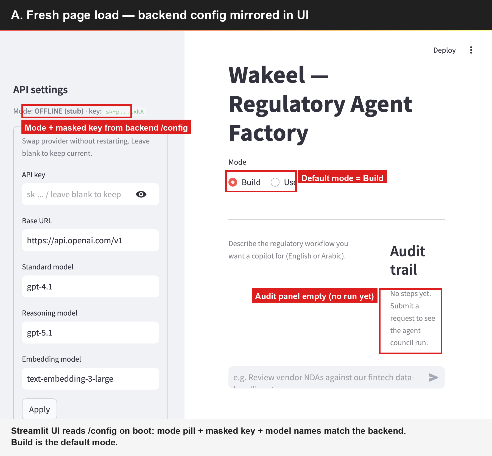
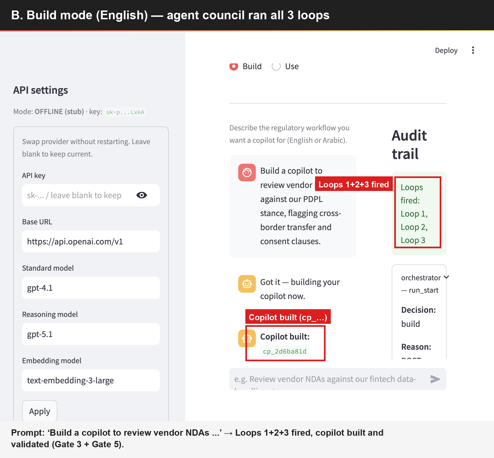
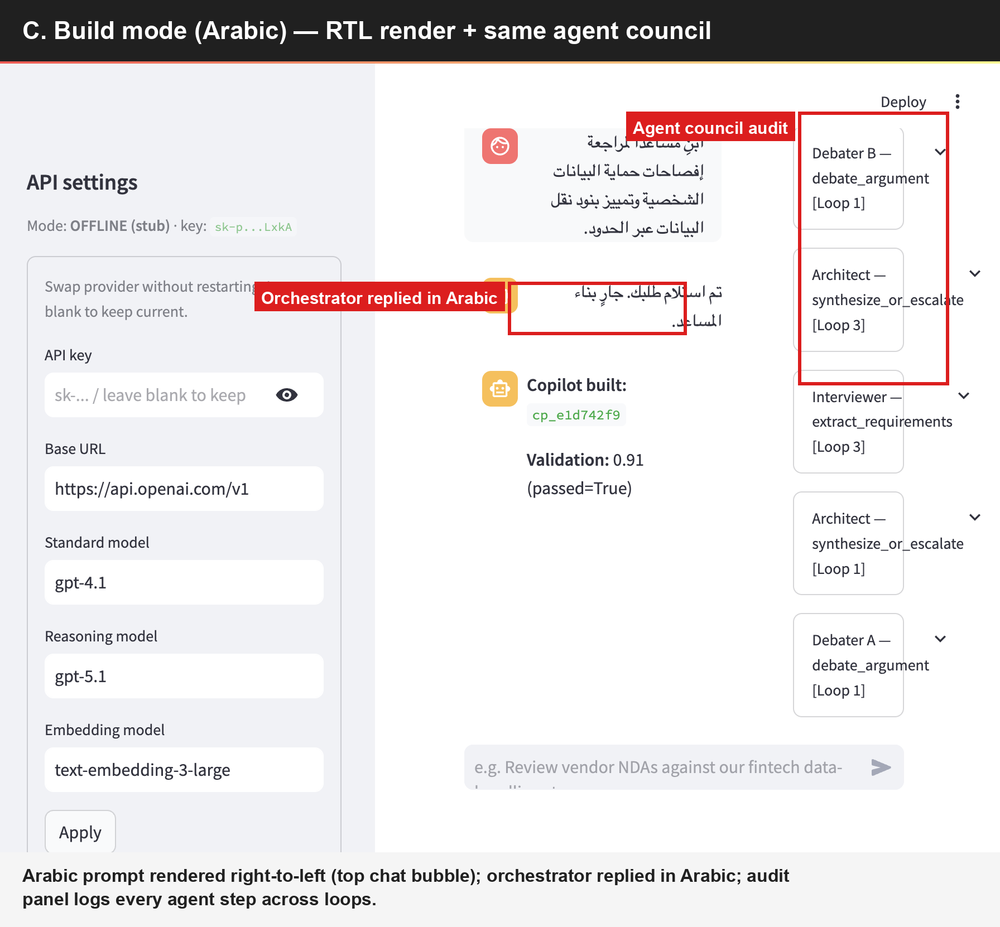
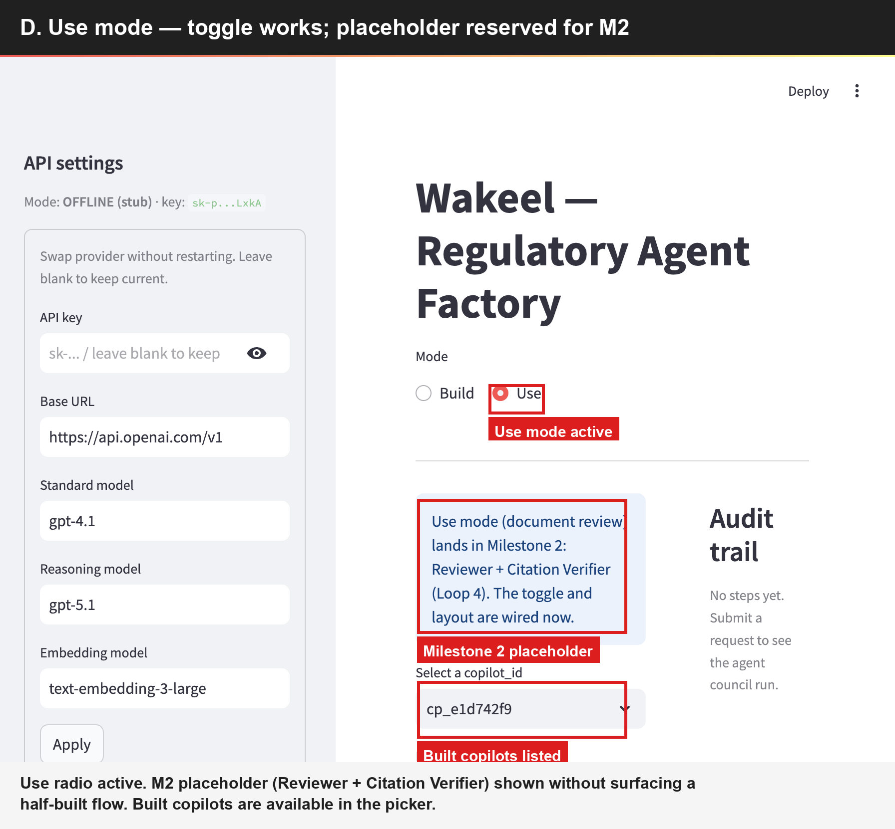
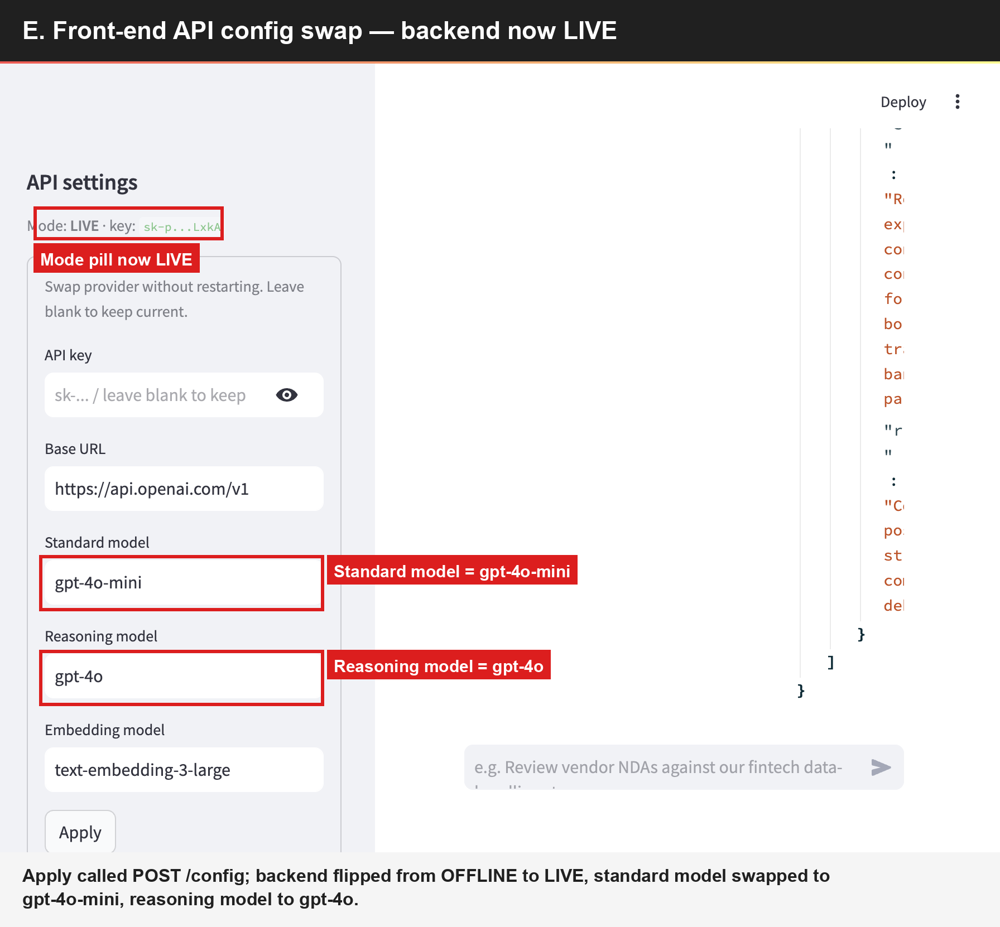

# Gate 4 — Manual UI Evidence (M1)

This page collects screenshots and backend snapshots captured during the
manual UI walkthrough of Gate 4 from `docs/verification.md`.

Each section shows an **annotated screenshot** that highlights the specific
proof the reviewer should look at — red boxes + labels point at the exact
UI element that satisfies the corresponding M1 acceptance criterion.

- **Run date:** 2026-06-01
- **Backend:** `uvicorn app.api:app` on `http://localhost:8000`
- **Frontend:** `streamlit run run_ui.py` on `http://localhost:8001`
- **API:** OpenAI direct (`https://api.openai.com/v1`) with the developer
  key provided in `PO_requirements/PO_message_history/message.md`
- **Run mode for Gate 4:** the developer keys provided so far have been
  out of billing quota at the OpenAI account level (`429
  insufficient_quota` on chat + embeddings, even though the key
  authenticates fine on `/v1/models`). So the UI walkthrough was captured
  in **offline stub mode** (`POST /config {"offline": true}`), which still
  exercises every agent, the retrieval pipeline, and all three feedback
  loops end-to-end. Gate 1 (live LLM smoke) is the founder's
  responsibility per the Milestone Amendment — it will close from his
  UAE laptop against Compass.

Section labels (A–E) match the checklist in
[`docs/verification.md`](verification.md) → *Gate 4 — Manual UI*.

---

## A. Fresh page load

The Streamlit app boots and the **API settings** panel mirrors the
backend `/config` response (mode pill, masked key, model names). The
build/use radio defaults to **Build** and the audit panel is empty.



---

## B. Build mode — English prompt

Submitted: *"Build a copilot to review vendor NDAs against our PDPL
stance, flagging cross-border transfer and consent clauses."*

The chat shows the user bubble, the orchestrator's acknowledgement, and
the final assistant message **`Copilot built: cp_2d6ba81d, Validation:
0.91 (passed=True)`**. The right-hand audit panel shows the green **Loops
fired** pill listing all three loops and the first
`orchestrator — run_start` audit entry.



This screenshot is the proof for **M1 acceptance items #3 (Build mode
happy path)** and **#5 (Feedback loops 1–3 firing)**.

---

## C. Build mode — Arabic prompt (RTL)

Submitted: *"ابنِ مساعدًا لمراجعة إفصاحات حماية البيانات الشخصية وتمييز
بنود نقل البيانات عبر الحدود."*

The user bubble renders right-to-left (top of the chat column), the
orchestrator replies in Arabic — *"تم استلام طلبك. جارٍ بناء المساعد."*
— and the audit panel logs the full agent council (Architect /
Interviewer / Debater A+B across Loops 1 and 3).



Proves **language-agnostic build path** and **agent council audit** — the
Arabic input is processed by the same graph as the English one, not
short-circuited.

---

## D. Use mode placeholder

Switching the mode radio to **Use** renders the M1 placeholder copy
(Reviewer + Citation Verifier — Loop 4 — is the M2 deliverable). The
copilot picker is populated with the copilots just built in sections B
and C, and the document text/upload slots are wired for M2.



Proves **toggle works**, **built copilots are addressable**, and the M2
slot is wired without surfacing a half-built flow.

---

## E. Front-end API config swap

From the left panel, set **Standard model** → `gpt-4o-mini` and
**Reasoning model** → `gpt-4o`, then pressed **Apply**. The UI flips its
pill from `OFFLINE (stub)` to **`LIVE`** and the form values update.
Hitting `GET /config` on the backend confirms the change took effect
server-side:

```json
{
  "offline_mode": false,
  "sample_mode": true,
  "base_url": "https://api.openai.com/v1",
  "api_key_masked": "sk-p...LxkA",
  "models": {
    "standard": "gpt-4o-mini",
    "reasoning": "gpt-4o",
    "embedding": "text-embedding-3-large"
  },
  "interviewer_model": ""
}
```

Raw response saved at
[`gate4-evidence/06b-backend-config-after-apply.json`](gate4-evidence/06b-backend-config-after-apply.json).



Proves the PO requirement from `PO_message_history/message.md`:

> *the build asks for flexibility to be able to customize the api keys,
> for now I can give you my OpenAI api and the. I should have the ability
> to change the API in the front end*

API key (masked input + show/hide), base URL, and all three model names
(standard / reasoning / embedding) are editable from the UI; `Apply`
calls `POST /config` which reloads the singleton `LLMClient` and reports
the new effective state back to the UI.

---

## Reproducing locally

```bash
# 1. Backend
uvicorn app.api:app --host 0.0.0.0 --port 8000

# 2. Frontend (separate shell)
streamlit run run_ui.py --server.port 8001

# 3. Walk through sections A-E in the UI

# 4. To re-run in stub mode (no live key needed):
curl -s -X POST http://localhost:8000/config \
     -H 'Content-Type: application/json' \
     -d '{"offline": true}'
```

For the automated equivalent of these gates, see `e2e_acceptance.py` and
`tests/` (Gates 1–3, 5) — both pass green on the current PR
[`feat/m1-build-mode-foundation`](https://github.com/hxcenteredai/wakeel/pull/1).
