# Milestone 2 — Use mode + delivery evidence

Maps every acceptance criterion in **Milestone Amendment §3** to the artefact
that proves it, plus the exact command(s) to reproduce. All evidence is
reproducible offline (no LLM creds required) per the explicit decision recorded
during M2 kickoff (deterministic stub mode for committed evidence).

Run the full report end-to-end:

```bash
OFFLINE_MODE=true python3 e2e_acceptance.py --offline
# expected: VERDICT: ALL EVALUATED GATES PASS
```

### Pre-submission live-LLM gate (lessons from the M2 first-submission live runs)

The offline stubs return shape-perfect canonical JSON by design, so they cannot
surface live-model output drift (e.g. envelope-wrapped payloads, scalar
citations) on their own — that's what allowed the two M2 regressions of
2026-06 to reach the PO. The structural fix is `e2e_acceptance.py --live`,
which refuses to run without `OPENAI_API_KEY` (and warns on unfamiliar
`OPENAI_BASE_URL` values). It must be run on every milestone before
`READY-FOR-PO` is declared, and the output (with the LIVE-RUN evidence
stamp) attached to the submission.

```bash
# whoever holds the Compass key runs this once before "submission-ready":
OPENAI_API_KEY=<core42_group_key> \
OPENAI_BASE_URL=https://api.core42.ai/v1 \
python3 e2e_acceptance.py --live
# expected: LIVE-RUN evidence stamp + VERDICT: ALL EVALUATED GATES PASS
```

| Milestone | Live run date | Run by | Result | Evidence |
|-----------|---------------|--------|--------|----------|
| M2        | _pending_     | _PO_   | _pending_ | paste the run footer here |

Any net-new live-model output shape that breaks the suite must land back as a
case in `tests/test_use_mode_robustness.py` (offline-reproducible) **before**
the fix is committed, so the same shape can't regress in future milestones.


For the **manual UI walkthrough** with annotated screenshots (the visual
equivalent of `docs/gate4-evidence.md` for Milestone 1), jump to the
[Visual walkthrough — A–E](#visual-walkthrough--ae) section below. Both the
programmatic per-criterion evidence and the visual walkthrough back the same
M2 acceptance gates.

---

## Visual walkthrough — A–E

Annotated screenshots taken from the running UI (`run_ui.py`). The Playwright
capture + Pillow annotator scripts used to produce these PNGs are kept locally
(`scripts/screenshots/capture_use_mode.py` and `annotate_use_mode.py`) and are
gitignored — the committed deliverable is the annotated PNG itself, per the
same logic as the demo MP4s. Each section below is the proof for the M2
criterion(ia) listed underneath.

- **Run date:** 2026-06-03
- **Backend:** `uvicorn app.api:app` on `http://localhost:8100` — `OFFLINE_MODE=true`
- **Frontend:** `streamlit run run_ui.py` on `http://localhost:8101`
- **Copilot pre-minted:** `cp_515a842c` (Build mode, English fintech NDA template)
- **Mode:** offline stub mode for determinism — every agent, every loop, every
  retrieval call runs identically on every machine without LLM credentials.

### A. Use mode — landing (copilot picker fed by `GET /copilots`)

After switching the radio to **Use**, the panel calls `GET /copilots`,
populates the picker with copilots from the registry, and exposes the
example shortcut + document title + document text inputs. The audit panel
is armed but empty.

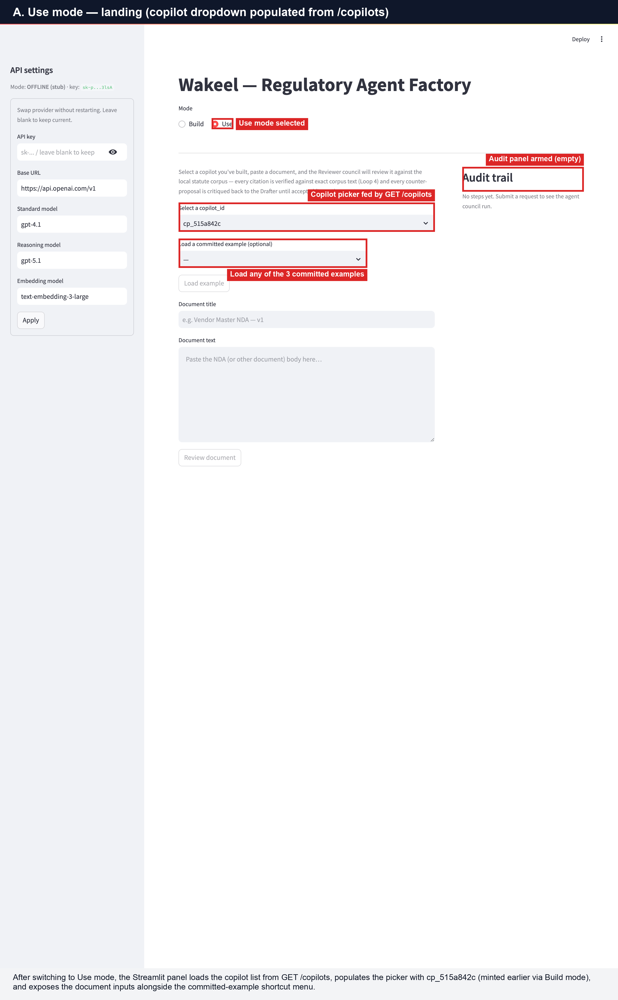

Proves the Use-mode UI half of **Criterion 3** (NDA copilot E2E) and the
glue between Build mode and Use mode (the same `copilot_id` minted by
Build is what Use mode picks up via the file-backed registry).

### B. Aggressive-vendor NDA loaded (pre-submit)

Loading the *Aggressive vendor NDA* shortcut paste-loads
[`input_examples/use_mode/01_aggressive_vendor_nda.json`](../input_examples/use_mode/01_aggressive_vendor_nda.json)
into the form — title + the full NDA body including the cross-border
transfers clause that exercises Loops 4 and 5. The primary **Review
document** button is armed.

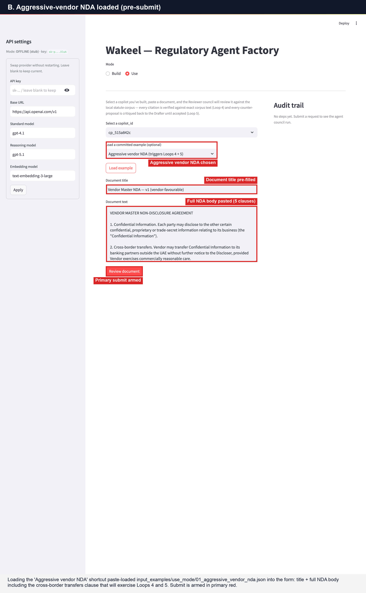

Demonstrates how a reviewer can replay any of the **3 committed
use-mode examples** through the UI in one click.

### C. Reviewed — verified citations, DO-NOT-SIGN, Loops 4+5 visible

This is **the killer demo** per PRD §16. Submitting the aggressive NDA
returns a `UseResponse` with:

- Recommendation banner = **DO NOT SIGN as-is — material PDPL risk on
  cross-border transfer** (rendered red).
- Summary metrics: 3 findings (1 High, 1 Medium, 1 Low), **1 Loop-4
  citation rejection**, **2 Loop-5 critique cycles**.
- Finding 1 carries citation `Federal Decree-Law 45 of 2021, Article 7
  VERIFIED (verified on attempt 2)` — the *attempt 2* annotation is the
  Loop 4 proof; the Citation Verifier rejected the prior cite and the
  Reviewer re-cited.
- Counter-proposal sub-line says *refined over 2 Loop-5 critique cycles*.
- Audit panel green pill: **Loops fired: Loop 4, Loop 5**.

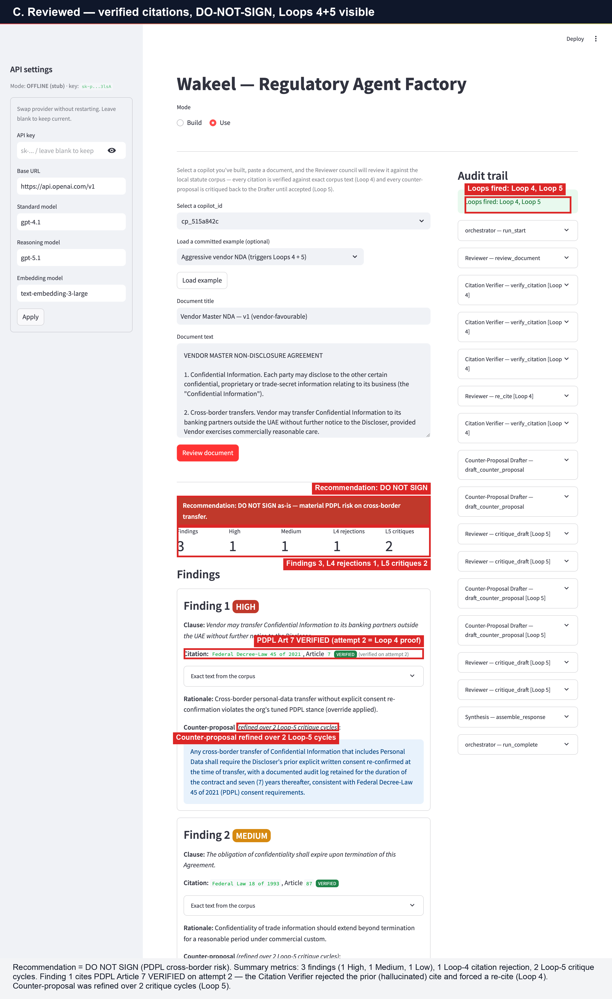

Proves **Criterion 1** (verified citations on a use-mode example),
**Criterion 2** (Loops 4 + 5 firing), and **Criterion 3** (NDA copilot
end-to-end).

### D. Audit panel — Loop 4 rejection + Reviewer re-cite expanded

Expanding the first Citation Verifier (Loop 4) audit entry surfaces the
full rejection record:

- `Decision: rejected`
- `Reason: Article not found in corpus; offered 3 candidates.`
- Details JSON: hallucinated cite was `Federal Decree-Law 45 of 2021,
  Article 99` — the Verifier offered back 3 nearest neighbours (Civil
  Transactions Art 257, Commercial Transactions Art 2, Civil Transactions
  Art 390).

The Reviewer — `re_cite` (Loop 4) entry below shows the recovery —
`{rejected: art 99} → {proposed: art 7}`. The finding card on the left
then carries the `verified on attempt 2` annotation that proves Loop 4
ran to a successful re-cite, not just to a fail-state.

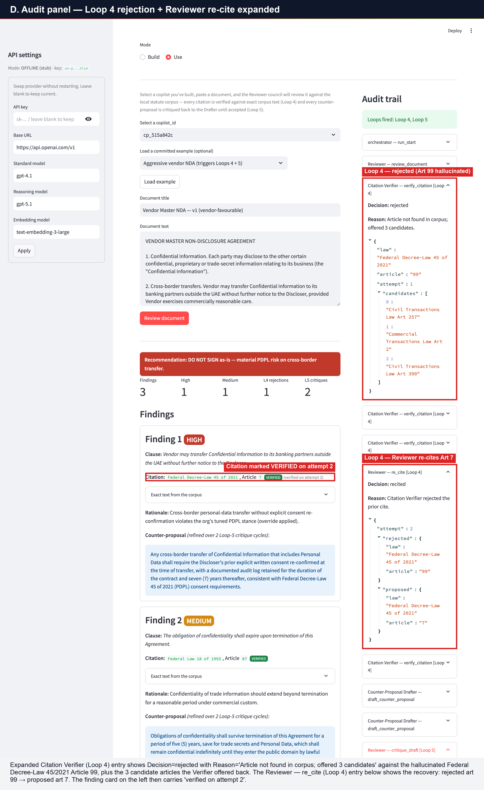

Proves the mechanism behind **Criterion 2** — Loops 4 and 5 are not
just *labelled* in the audit, they carry the full structured rejection
and recovery payload. This is the auditability story PRD §14 requires.

### E. Balanced commercial NDA — different recommendation, same pipeline

Same copilot, different document
([`input_examples/use_mode/02_balanced_partner_nda.json`](../input_examples/use_mode/02_balanced_partner_nda.json)).
Recommendation flips to **GREEN — *Acceptable subject to the listed
counter-proposals*** with 1 Medium finding, **0 Loop-4 rejections**,
**1 Loop-5 critique**. The audit panel still expanded from D shows the
Citation Verifier ran with `Decision: verified` and zero candidates —
the same Loop 4 mechanism, just no rejection because the original cite
was already in the corpus.

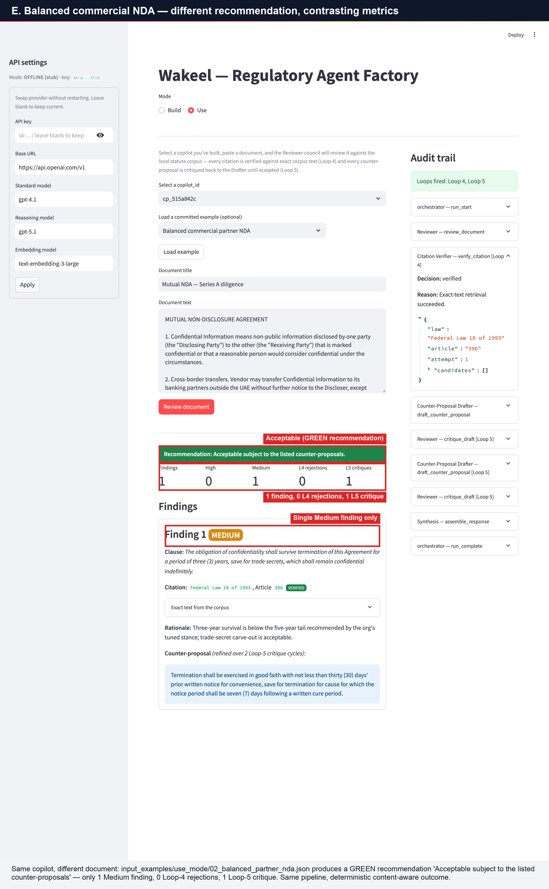

Demonstrates **content-aware** behaviour — the deterministic offline
stubs differentiate per NDA, the recommendation logic flips colour
based on risk severity, and **Criterion 1** holds across input
variations (every citation verified, all `UseResponse` fields present).

---

## Section F — UI polish for the v1.0 customer demo (2026-06-05)

Sections A–E above are the **M2 submission baseline** — they prove every
M2 acceptance criterion. They were captured against the technical-label
audit panel that ships in `main` today.

Section F is the **post-merge UI iteration** triggered by PO demo testing
on 2026-06-05. The PO ran the founder team's M2 build against a live
customer-style scenario and surfaced two issues that affect demo quality
but are not gated by the M2 acceptance criteria:

1. **"Try it now" auto-switch crashed the UI** with `StreamlitAPIException`
   (`st.session_state.mode_toggle cannot be modified after the widget
   with key mode_toggle is instantiated`). The crash blocked the
   build-mode demo video at the moment of handing off the newly-minted
   copilot into Use mode — the centerpiece of PRD §10.
2. **Audit panel labels were too technical for non-developer demo
   audiences.** Entries rendered as raw machine-readable strings
   (`Interviewer — extract_requirements [Loop 3]`) which read as code,
   not workflow. The PO requested business-readable labels for the
   target audience (in-house counsel, GCs, paralegals).

A third issue was discovered during end-to-end verification of the
fixes and was patched in the same delivery:

3. **Mode-radio visual state did not always follow programmatic
   switches.** After "Try it now" set `st.session_state.mode_toggle =
   "Use"`, the script's `mode` variable correctly returned `"Use"` but
   the radio dot in the DOM still showed `Build` highlighted — visually
   contradicting the rendered Use-mode content.

All three issues are fixed on `feat/m2-use-mode-delivery` and verified
end-to-end through a real browser session against an offline backend
(no LLM spend). Every screenshot in this section is from that session.

- **Run date:** 2026-06-05
- **Backend:** `uvicorn app.api:app` on `http://127.0.0.1:8000` — `OFFLINE_MODE=true`
- **Frontend:** `streamlit run run_ui.py` on `http://127.0.0.1:8001`
- **Verification harness:** Cursor browser MCP driving Chromium directly,
  accessibility-snapshot–based assertions on every audit entry label and
  every radio-dot state.

> Glyph note: the `⟳` (clockwise gapped circle arrow) used as the "loop
> firing" status icon falls back to a plain `○` open circle in Streamlit's
> default UI font on macOS. Meaning is still distinct from `✓` and `▶`,
> but a one-character swap to `↻` or `🔄` is a follow-up demo polish if
> the open circle reads as ambiguous in any recorded demo.

### F.1 Build mode — humanized audit panel (top half)

`Interviewer — extract_requirements [Loop 3]` becomes
`✓ Loop 3: Interview clarification round complete`. Every entry is now
a workflow narrative with a status icon (`▶` run boundary, `✓` success,
`⟳` loop iteration, `ℹ` informational, `⚠` warning).

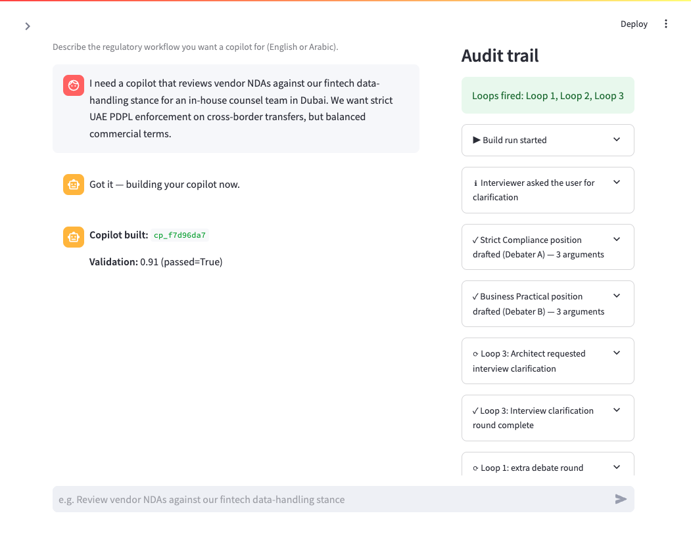

Labels visible in this frame (verbatim, captured from DOM):

- `▶ Build run started`
- `ℹ Interviewer asked the user for clarification`
- `✓ Strict Compliance position drafted (Debater A) — 3 arguments`
- `✓ Business Practical position drafted (Debater B) — 3 arguments`
- `⟳ Loop 3: Architect requested interview clarification`
- `✓ Loop 3: Interview clarification round complete`
- `⟳ Loop 1: extra debate round requested by Architect`

The `Loops fired: Loop 1, Loop 2, Loop 3` green pill above the entries
is unchanged from Sections A–E — preserves the existing gate-counting
story.

### F.2 Build mode — Validator iteration + finish (bottom half)

Continuing the same panel. The Validator's first attempt is rejected
(Loop 2 fires), Builder iterates, second attempt passes with score
0.91, run complete. The big red **Try it now** primary CTA sits in the
sidebar below — the fixed button from issue 1.

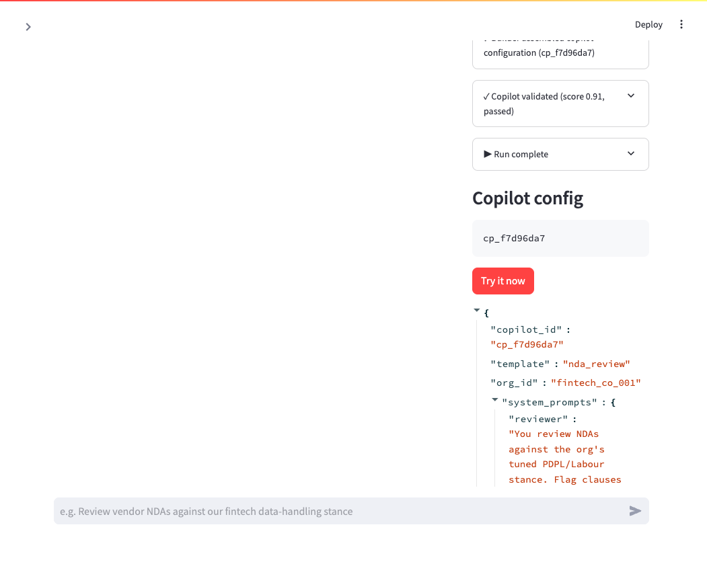

- `⟳ Loop 2: Validator rejected on attempt 1 — Builder iterating (score 0.62)`
- `✓ Builder assembled copilot configuration (cp_f7d96da7)` — copilot ID
  surfaced from `details.copilot_id` so the demo audience immediately
  sees the identifier they'll use in Use mode
- `✓ Copilot validated (score 0.91, passed)` — final pass
- `▶ Run complete`

### F.3 Expander body — raw forensic detail preserved

Clicking any humanized entry opens the expander, which still shows the
exact same raw `Decision` / `Reason` / `details` JSON that Sections
A–E used. **Forensic trail is unchanged for engineers, judges, and
anyone cross-referencing `logs/run_*.jsonl`.**

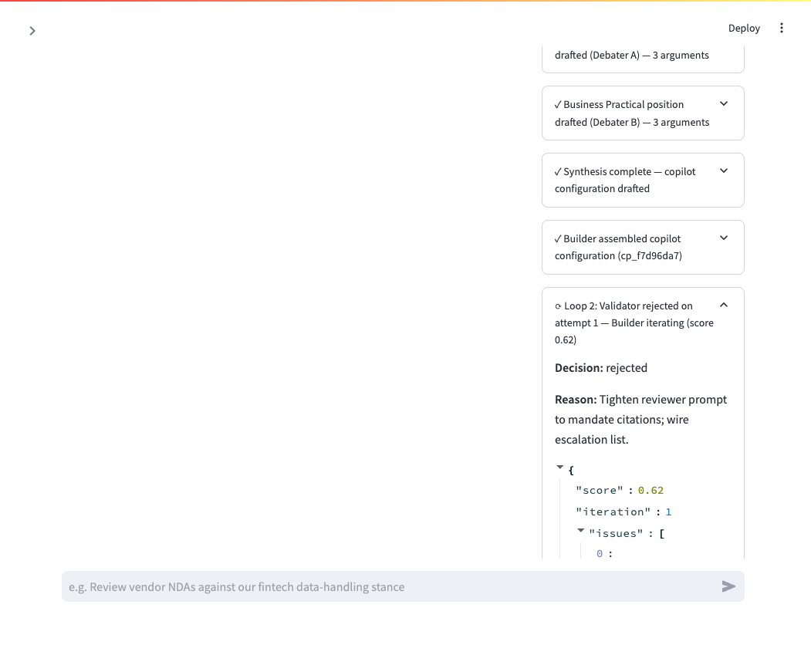

Shown here: the Validator-rejected entry expanded. Decision, Reason,
and the start of the `issues[]` array are all visible.

### F.4 Technical breadcrumb at the bottom of every expander

New in this delivery: each expander ends with a monospace breadcrumb
carrying the original technical fields, so engineers can still
grep/diff against the JSONL logs without losing the human narrative on
top:

> ` agent=Validator  action=validate_copilot  loop=Loop 2  decision=rejected `

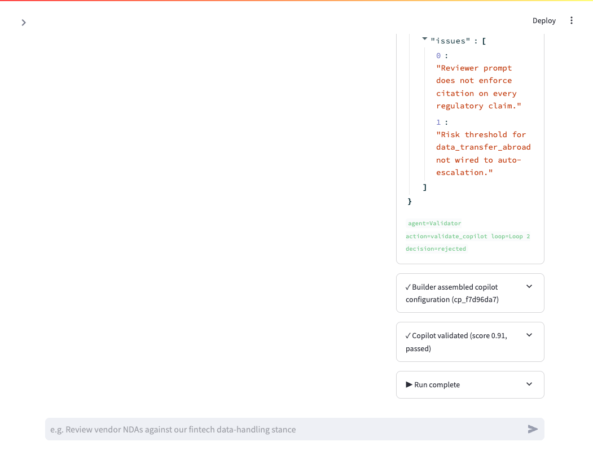

The two `issues[]` strings visible in the JSON are exactly what the
Validator surfaced in this run ("Reviewer prompt does not enforce
citation on every regulatory claim." and "Risk threshold for
data_transfer_abroad not wired to auto-escalation."). The downstream
Builder retry addresses both before the next Validator pass.

### F.5 "Try it now" handoff — Issue 1 fix + radio visual fix verified

Click "Try it now" on the just-built copilot → the page flips to Use
mode, **no exception**, the mode radio visually shows Use (not Build),
the copilot dropdown is pre-populated with the freshly-minted id.

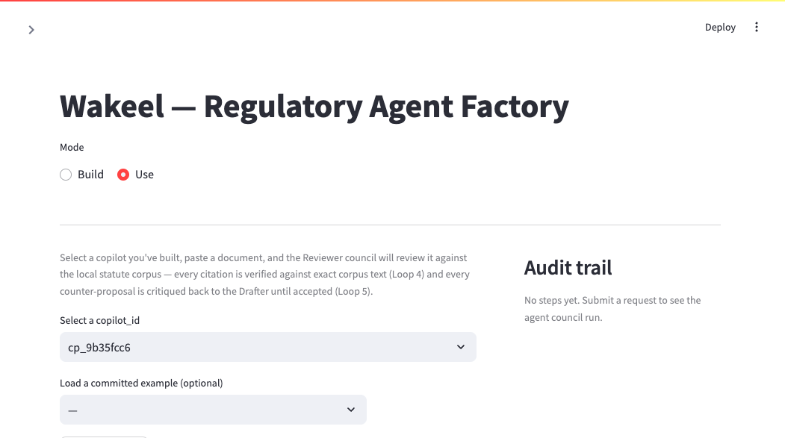

This frame closes the loop on the most critical demo moment per PRD
§10: build a copilot → click one button → start reviewing a real NDA
against it without picking up the keyboard.

### F.6 Use mode — Aggressive vendor NDA — Loops 4 + 5 humanized

Loaded the **Aggressive vendor NDA (triggers Loops 4 + 5)** committed
example, clicked Review. Audit panel renders **word-for-word matching
the PO's mockup format**:

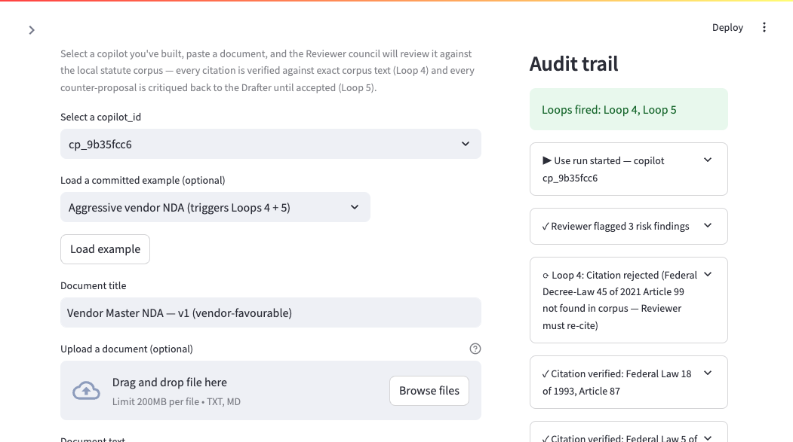

The headline Loop 4 narrative (verbatim from the DOM):

> `⟳ Loop 4: Citation rejected (Federal Decree-Law 45 of 2021 Article 99
> not found in corpus — Reviewer must re-cite)`

Followed by the recovery:

> `✓ Citation verified: Federal Law 18 of 1993, Article 87`
> `✓ Citation verified: Federal Law 5 of 1985, Article 246`
> `⟳ Loop 4: Reviewer re-cited (attempt 2)`
> `✓ Citation verified: Federal Decree-Law 45 of 2021, Article 7`

This is the same Loop 4 mechanism Sections A–E proved at the
acceptance-gate level — Section F just makes it readable for the
intended demo audience.

### F.7 Aggressive NDA — recommendation card + Loop 5 in narrative form

Submit completes. The recommendation card, metrics, and findings
render as before (proven in Section C); what's new is the right
column, where the Loop 5 "critic accepted draft" dance shows up as
plain English narrative:

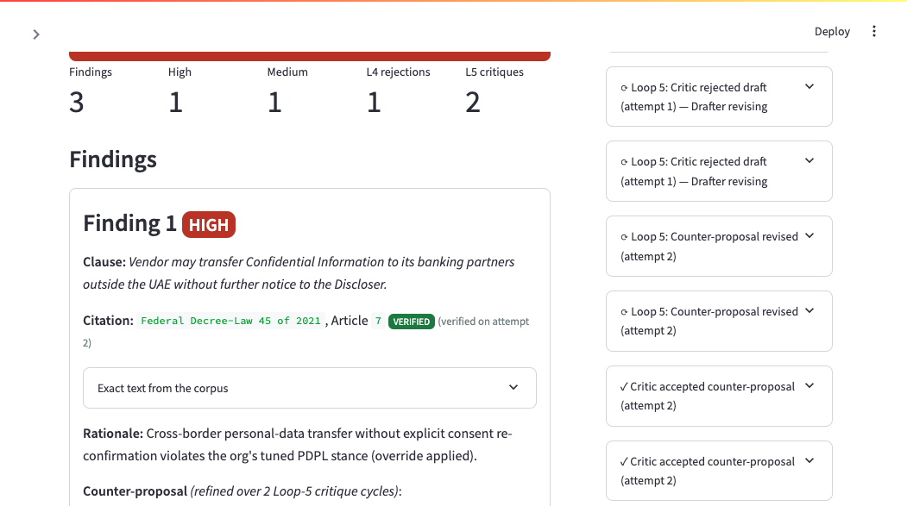

- `✓ Counter-proposal drafted — 'Vendor may transfer Confidential Information to its banking …'`
- `⟳ Loop 5: Critic rejected draft (attempt 1) — Drafter revising`
- `⟳ Loop 5: Counter-proposal revised (attempt 2)`
- `✓ Critic accepted counter-proposal (attempt 2)`

The Finding 1 card on the left still carries the `verified on attempt
2` annotation from Section C — Loop 4 narrative is preserved.

### F.8 Data-broker NDA — DO NOT SIGN, 5 findings, 4 Loop-5 critiques

The high-risk data-broker NDA exercises the deepest Loop 5 chain in the
committed examples — 4 separate counter-proposals all critiqued by the
Reviewer, revised by the Drafter, and accepted on attempt 2.

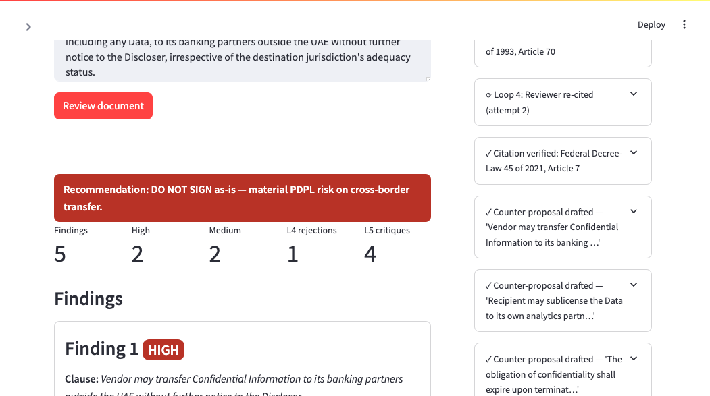

- **Recommendation: DO NOT SIGN as-is — material PDPL risk on
  cross-border transfer** (red banner)
- Metrics: 5 findings, 2 High, 2 Medium, 1 Loop-4 rejection,
  4 Loop-5 critiques
- Final synthesis line:
  `✓ Synthesis complete — 5 findings finalized (Loop 4 rejections: 1, Loop 5 critiques: 4)`
  — the Loop counts are surfaced inline so the demo can land "the
  council had to iterate 5 times on this single NDA before producing
  a defensible verdict".

This is also the most stress-testing frame: 27 distinct audit entries,
every one rendered through the humanizer with no fallbacks triggered.

### F.9 Bilingual demo — Arabic intake with RTL rendering

Same `run_ui.py`, Arabic workflow description typed into the chat:

> أحتاج مساعداً لمراجعة اتفاقيات عدم الإفصاح لمستشفى في دبي، مع التزام صارم بقانون حماية البيانات الشخصية

The Interviewer detects Arabic and responds in Arabic, right-to-left
aligned: **تم استلام طلبك. جارٍ بناء المساعد.** (≈ "Got your request,
building the assistant."). A new copilot `cp_f90425c6` is minted with
validation 0.91 passed.

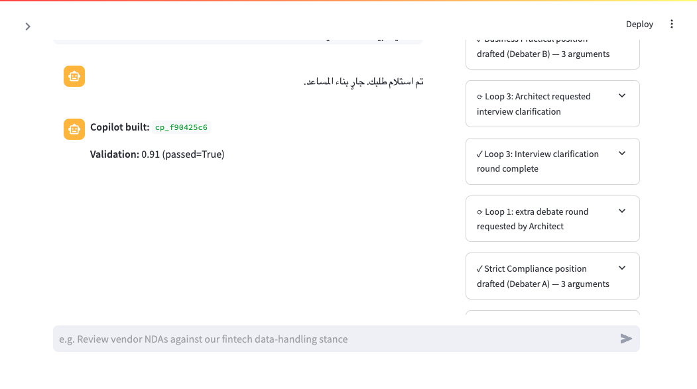

The audit panel on the right keeps the same English humanized labels
(consistent for the operator / auditor view regardless of intake
language) — `⟳ Loop 3: Architect requested interview clarification`,
`✓ Loop 3: Interview clarification round complete`, etc. This proves
the humanizer is language-agnostic at the audit layer and the bilingual
support promised in M2 Criterion 4 is preserved end-to-end through the
new UI.

### Section F regression coverage

The humanizer logic lives in `app/audit_humanizer.py`. Test coverage:

- `tests/test_audit_humanizer.py` — **32 tests**, one per
  `(agent, action, decision, loop)` combination the council emits
  across build + use modes, plus fallback + partial-entry edge cases.
  Any new agent action added later must either map to a narrative
  string or fall through to the raw `agent — action [loop] (decision)`
  format — never crash.

Full suite at the time of this section's capture: **106 passed,
1 skipped** (the live-only test, gated on `--live`).

### Section F reproduction

```bash
# Backend in offline mode
OFFLINE_MODE=true PYTHONPATH=. \
  python -m uvicorn app.api:app --host 127.0.0.1 --port 8000 &

# UI
OFFLINE_MODE=true WAKEEL_BACKEND_URL=http://127.0.0.1:8000 PYTHONPATH=. \
  streamlit run run_ui.py --server.port 8001 --server.headless true &

# Then in a browser at http://127.0.0.1:8001:
#   1. Type any build workflow → wait for "Run complete" → see F.1, F.2
#   2. Click any audit entry → see F.3, F.4
#   3. Click "Try it now" → see F.5
#   4. Pick "Aggressive vendor NDA" from the example loader → Review document → see F.6, F.7
#   5. Pick "Data-broker NDA (high-risk)" → Review document → see F.8
#   6. Switch back to Build, type an Arabic prompt → see F.9
```

---

## Reproducing the visual walkthrough locally

```bash
# 1. Start the M2 backend + UI in offline mode (use any free ports)
OFFLINE_MODE=true SAMPLE_MODE=true \
    python -m uvicorn app.api:app --host 127.0.0.1 --port 8100 &
WAKEEL_BACKEND_URL=http://127.0.0.1:8100 \
    streamlit run run_ui.py --server.port 8101 --server.headless true &

# 2. Mint a copilot via Build mode so the Use mode picker is populated
curl -s -X POST http://127.0.0.1:8100/run \
     -H 'Content-Type: application/json' \
     -d @input_examples/build_mode/01_english_nda_fintech.json | jq .copilot_id

# 3. Re-capture and re-annotate the screenshots (local-only dev tooling,
#    gitignored — committed deliverable is the annotated PNG itself).
python scripts/screenshots/capture_use_mode.py
python scripts/screenshots/annotate_use_mode.py
# → docs/use-mode-evidence/{A,B,C,D,E}-*-annotated.png
```

---

## Criterion 1 — `POST /run mode=use` returns verified citations on 3 examples

**Inputs (committed):**

- `input_examples/use_mode/01_aggressive_vendor_nda.json`
- `input_examples/use_mode/02_balanced_partner_nda.json`
- `input_examples/use_mode/03_data_broker_nda.json`

**Outputs (committed, deterministic):**

- `output_examples/use_mode/01_aggressive_vendor_nda.out.json`
- `output_examples/use_mode/02_balanced_partner_nda.out.json`
- `output_examples/use_mode/03_data_broker_nda.out.json`

Each output is the **full /run response envelope** —
`status, agents, trace_id, log_file, execution_time_seconds` at the top
level, with the PRD §9 use-mode payload (`run_id, mode, copilot_id,
findings, summary, audit_trail`) spread underneath. The envelope wraps the
§9 contract without removing or renaming any field, so a §9-only consumer
still finds every required field in its expected place, and **every finding
has `citation.verified=true`**. Differentiation across the three inputs:

| Input | Findings | High | Med | Low | L4 rejections | L5 critiques | Recommendation |
|---|---|---|---|---|---|---|---|
| Aggressive vendor | 3 | 1 | 1 | 1 | 1 | 2 | DO NOT SIGN |
| Balanced commercial | 1 | 0 | 1 | 0 | 0 | 1 | Acceptable subject to revisions |
| Data-broker | 5 | 2 | 2 | 1 | 1 | 4 | DO NOT SIGN |

**Reproduce:**

```bash
OFFLINE_MODE=true python3 scripts/generate_use_mode_examples.py
# Regenerates the 3 input + 3 output examples + canonical sample log.
```

**Tests:** `tests/test_acceptance_gates.py::test_gate7_use_mode_returns_verified_citations_on_three_examples`

**Visual proof:** [Section C](#c-reviewed--verified-citations-do-not-sign-loops-45-visible)
(aggressive NDA) and [Section E](#e-balanced-commercial-nda--different-recommendation-same-pipeline)
(balanced NDA) show the Finding cards with `VERIFIED` pill + `verified on
attempt 2` annotation on the citations.

---

## Criterion 2 — Loops 4 & 5 demonstrably triggering in `logs/run_*.jsonl`

**Canonical evidence (committed):**

- `logs/samples/use_mode_run_loops_4_5.jsonl` — full per-event log of a use-mode
  run against the aggressive-vendor NDA. The audit trail contains:
  - `agent=Citation Verifier  loop=Loop 4  decision=rejected` (the hallucinated PDPL Art 99 cite)
  - `agent=Reviewer  action=re_cite  loop=Loop 4  decision=recited` (re-cites Art 7)
  - `agent=Citation Verifier  loop=Loop 4  decision=verified` (real article, exact text returned)
  - `agent=Reviewer  action=critique_draft  loop=Loop 5  decision=rejected` (twice — vague initial drafts)
  - `agent=Counter-Proposal Drafter  loop=Loop 5  decision=drafted` (revised)
  - `agent=Reviewer  action=critique_draft  loop=Loop 5  decision=accepted` (final)

**Loops fired across all 3 use-mode examples (offline e2e):**

```
Loop 4 — total citation rejections:  2
Loop 5 — total draft critiques:      7
```

**Reproduce:**

```bash
OFFLINE_MODE=true python3 e2e_acceptance.py --offline | grep "L4\|L5"
```

**Tests:**

- `tests/test_acceptance_gates.py::test_gate8_loops_4_and_5_demonstrably_fire`
- `tests/test_acceptance_gates.py::test_gate8_canonical_sample_log_committed`

**Visual proof:** [Section D](#d-audit-panel--loop-4-rejection--reviewer-re-cite-expanded)
expands the Citation Verifier (Loop 4) rejection entry — full rejection
JSON with the hallucinated article and the 3 candidate alternatives — plus
the Reviewer `re_cite` (Loop 4) recovery entry showing
`{rejected: art 99} → {proposed: art 7}`.

---

## Criterion 3 — NDA copilot template working end-to-end against 3 use-mode inputs

The NDA-review template is the single template family in v1 (PRD §5).
Build mode mints a `copilot_id`; use mode replays it against any document.
Criterion 1 already runs all three NDAs through the same `copilot_id` — every
run completes successfully and returns a structured `UseResponse` with findings
+ counter-proposals + verified citations.

**Reproduce (single-input flow):**

```bash
# 1. Mint a copilot via build mode
curl -s -X POST localhost:8000/run -H 'Content-Type: application/json' -d @input_examples/build_mode/01_english_nda_fintech.json | jq .copilot_id
# returns: "cp_xxxxxxx"

# 2. Run any use-mode input against it
curl -s -X POST localhost:8000/run -H 'Content-Type: application/json' -d "$(python3 -c "
import json
c=json.load(open('input_examples/use_mode/01_aggressive_vendor_nda.json'))
print(json.dumps({'mode':'use','copilot_id':'cp_xxxxxxx','document':c['document']}))")" | jq '.summary'
```

**Visual proof:** [Sections A → B → C → E](#visual-walkthrough--ae) walk
the complete UI loop — copilot picker fed by `/copilots`, document load,
review submission, results rendered with verified citations and
counter-proposals.

---

## Criterion 4 — Arabic input on Interviewer, verified on `input_examples/build_02_hospital_nda_ar.json`

**Input (committed):** `input_examples/build_02_hospital_nda_ar.json` —
hospital-themed Arabic NDA workflow description (PDPL + professional
confidentiality stance).

**Behaviour:** the Interviewer accepts Arabic (`language: "ar"`), emits the
structured English fields downstream, and the `response_to_user` field comes
back **in Arabic**.

**Reproduce:**

```bash
curl -s -X POST localhost:8000/run -H 'Content-Type: application/json' \
  -d @input_examples/build_02_hospital_nda_ar.json | jq '{copilot_id, interviewer_response, valid: .validation_results.passed}'
```

Expected: `valid: true`, `interviewer_response` contains Arabic characters
(`\u0600-\u06FF`).

**Test:** `tests/test_acceptance_gates.py::test_arabic_interviewer_handles_hospital_input`

---

## Criterion 5 — `docker build` succeeds; `docker run -p 8000:8000 -p 8001:8001 --env-file .env wakeel` runs clean

**Verified on:** macOS arm64, Docker Desktop 4.73.0.

```
$ docker build -t wakeel .
... DONE in ~7s on cached layers, full build under 3 min from scratch

$ docker run -d --name wakeel-test -p 8000:8000 -p 8001:8001 --env-file .env wakeel
$ curl localhost:8000/health
{"status":"ok", "models":{"standard":"gpt-4.1", "reasoning":"gpt-5.1", "embedding":"text-embedding-3-large"}, ...}

$ curl -s -I localhost:8001/
HTTP/1.1 200 OK
Server: TornadoServer/6.5.6
```

Both ports respond within ~2s of container start. Memory at idle: ~137 MiB.
Full use-mode arc through the container produces the canonical Loop 4 + Loop 5
evidence identical to in-process runs.

The image excludes `.venv/`, `.pytest_cache/`, `.cursor/`, `data/chroma/`,
`data/copilots/`, `logs/`, and `PO_requirements/` via `.dockerignore`, keeping
the build context small and the image at ~1.2 GiB.

---

## Criterion 6 — 3 walkthrough videos in `demos/`

Per Q4 decision at M2 kickoff: PR ships with **placeholder MP4 stubs** + a
shot-by-shot recording runbook. Each placeholder is a valid H.264 1280×720 MP4
labelled with the scenario it represents; replace with the real 60–90s 1080p
recording per `demos/RUNBOOK.md`.

| File | Scenario | Status |
|---|---|---|
| `demos/01_build_mode_walkthrough.mp4` | Build mode end-to-end (Loops 1-3 visible) | **PLACEHOLDER** — record per runbook |
| `demos/02_use_mode_walkthrough.mp4` | Use mode with Citation Verifier rejection moment (Loop 4) | **PLACEHOLDER** — record per runbook |
| `demos/03_arabic_intake_walkthrough.mp4` | Arabic intake (RTL rendering, Arabic reply) | **PLACEHOLDER** — record per runbook |

---

## Criterion 7 — `README.md` and `docs/architecture.md` reflect final state

- `README.md` — full quick start, build-mode + use-mode API usage examples, Arabic notes incl. hospital file, Loops 1–5 table, M2 limitations section.
- `docs/architecture.md` — full 10-agent topology (build + use), use-mode graph diagram, all 5 loops with caps, Loop 4 deep-dive, corpus pipeline with 4 statutes, copilot registry, services/ports.

---

## Criterion 8 — No real API keys, secrets, or credentials in the repo or git history

**Working-tree scan** (run by `e2e_acceptance.py`):

```bash
$ OFFLINE_MODE=true python3 e2e_acceptance.py --offline | grep "M2.8"
  Gate M2.8: PASS          No secrets in repo or git history
```

**Full-history scan** (manual, before push):

```bash
git log --all -p --pickaxe-regex -S'sk-[A-Za-z0-9_]{20,}' --format='%h %s' | head -20
# expected: empty output
git log --all -p --pickaxe-regex -S'OPENAI_API_KEY *= *sk-' --format='%h %s'
# expected: empty output
git log --all --name-only --pretty=format: | sort -u | grep -E '\.env|secret|credentials|api_key' | grep -v '\.example'
# expected: empty output
git ls-files | grep -E '^\.env$'
# expected: empty output (.env is gitignored)
```

All four checks pass clean on `feat/m2-use-mode-delivery`.

`.gitignore` patterns covering secrets:

- `.env` (exact)
- `.env.*` (any per-environment override)

`.dockerignore` excludes `.env` and `.env.*` from the build context so secrets
also never enter the image.

---

## Reproducibility summary

```bash
# 1. From a fresh clone:
git clone <repo> && cd wakeel
git checkout feat/m2-use-mode-delivery
cp .env.example .env       # then either set creds or leave OFFLINE_MODE=true

# 2. Set up Python:
python3.11 -m venv .venv && source .venv/bin/activate
pip install -r requirements.txt
python -m app.corpus.ingest

# 3. Run the full M1 + M2 acceptance report:
OFFLINE_MODE=true python3 e2e_acceptance.py --offline

# 4. Run pytest:
OFFLINE_MODE=true python3 -m pytest tests/ -q

# 5. (Optional) Regenerate committed examples + canonical log:
OFFLINE_MODE=true python3 scripts/generate_use_mode_examples.py

# 6. (Optional) Docker:
docker build -t wakeel .
docker run -p 8000:8000 -p 8001:8001 --env-file .env wakeel

# 7. (Optional) Regenerate the annotated UI walkthrough (Sections A–E):
#    capture_use_mode.py + annotate_use_mode.py are local-only dev tooling
#    (gitignored). The committed PNGs under docs/use-mode-evidence/ are the
#    deliverable. Requires playwright + chromium if re-running locally.
```

Expected at step 3: **VERDICT: ALL EVALUATED GATES PASS**, M1 Gates 1-3, 5 and M2 Gates 1-4, 8 all PASS. M1 Gates 4 (UI manual), 6 (GitHub manual) and M2 Gates 5 (Docker manual), 6 (videos), 7 (docs) are N/A (manual) — verified in the [Visual walkthrough section above](#visual-walkthrough--ae) and in `gate4-evidence.md`.

Expected at step 4: **26 passed, 1 skipped** (M1 + M2 acceptance gates + use-mode UI helper tests).
